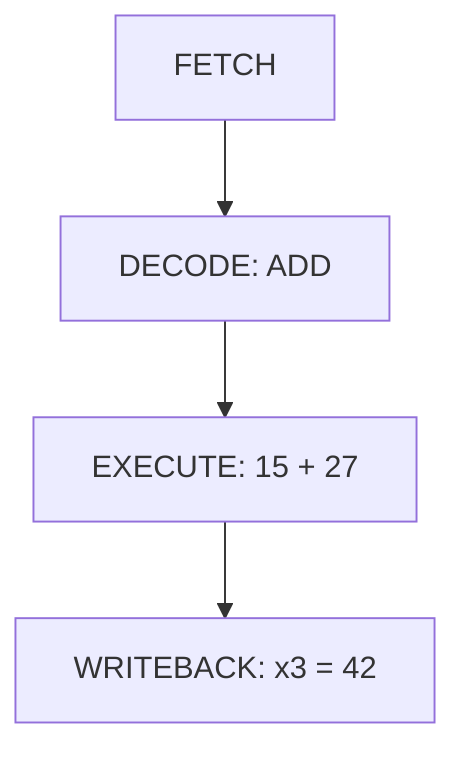

# Risc-V Learnings -

My simple study notes on RISC-V architecture, how it works, and its core concepts and simulations.

---

## What is RISC-V?
* **Open Source Standard:** RISC-V is a free instruction set architecture (ISA). It's not a physical CPU chip, but a set of rules for processors.
* **Alternative to Proprietary ISAs:** It acts as an open-source alternative to ARM and x86.
* **Role of ISA:** It serves as a bridge/language between software code and hardware circuits.

*The official RISC-V organization describes itself as the Open-Standard Instruction Set Architecture.*

*Don't confuse these three things:*

* **CPU:**
The actual electronic hardware.

* **ISA:**
The language/rules that software uses to tell the CPU what to do.

* **RISC-V:**
One particular ISA.

**(Reduced Instruction Set Computer - V)**
_Keep the instruction set relatively simple and regular so that hardware can implement it efficiently._

* **Simple instruction:**
add x3, x1, x2
* **Meaning:**
x3 = x1 + x2
---

## x86 vs ARM vs RISC-V:
* **x86 (Intel/AMD):** Proprietary, complex, used in desktop PCs and servers. Companies pay heavy licensing fees.
* **ARM (Apple, Qualcomm):** Used in almost all smartphones. It is power-efficient, but companies must pay ARM high fees to design custom chips.
* **RISC-V (Reduced Instruction Set Computer - V):** An open-source, royalty-free architecture. Anyone can design, modify, and build chips using RISC-V without paying licensing fees or royalties to a single corporation.

## Core Features & Extensions

RISC-V starts with a simple base system and lets you add features (extensions) as needed:

* **RV32I / RV64I:** Base integer instruction sets (32-bit and 64-bit).
* **M Extension:** Adds hardware multiplication and division.
* **A Extension:** Atomic operations for multi-threaded code.
* **F / D Extensions:** Single and double precision floating-point math.
* **C Extension:** Compressed instructions to save memory space.
* **V Extension:** Vector processing for AI and signal processing workloads.

---

## RISC-V Registers (The Temporary Workspace)
Registers are super-fast internal storage slots. RISC-V has **32 general-purpose registers** named `x0` to `x31`. 

Here are the most important ones you need to know as a beginner:
* **`x0` (zero):** Hardwired to always be exactly `0`. You cannot change it.
* **`x1` (ra):** Return Address. Remembers where a function was called from so the program can jump back.
* **`x2` (sp):** Stack Pointer. Manages temporary memory workspace allocation blocks.
* **`x5 to x7` (t0 to t2):** Temporary registers used to store quick calculations.
* **`x10 to x11` (a0 to a1):** Used to pass inputs into your functions and return the final answers.

## How Code Executes (4 Pipeline Stages)

Every instruction goes through 4 basic steps inside the processor:

1. FETCH   │ ──► │  2. DECODE  │ ──► │ 3. EXECUTE  │ ──► │ 4. WRITEBACK│
   and this process repeats.

1. **Fetch:** Get the instruction from memory.
2. **Decode:** Figure out what operation needs to be done.
3. **Execute:** Run the calculation on the ALU.
4. **Writeback:** Save the final result back into a register.

* **Example:**
_add x3, x1, x2_

If: x1 = 15
; x2 = 27

then:

**Venus Simulation Verification**

_I have successfully written, assembled, and executed this addition operation inside the **Venus RISC-V Simulator**._

---

## Important Rules to Remember

* **Load/Store Architecture:** You cannot do math directly inside RAM. Data must first be loaded into registers (`lw`), processed, and then saved back to memory (`sw`).
* **The Special `x0` Register:** Register `x0` is hardwired to 0. It is useful for copying values and creating zeroed registers easily.
* **AI Offloading:** RISC-V core works as a controller that passes heavy mathematical operations to GPUs or AI vector units.
